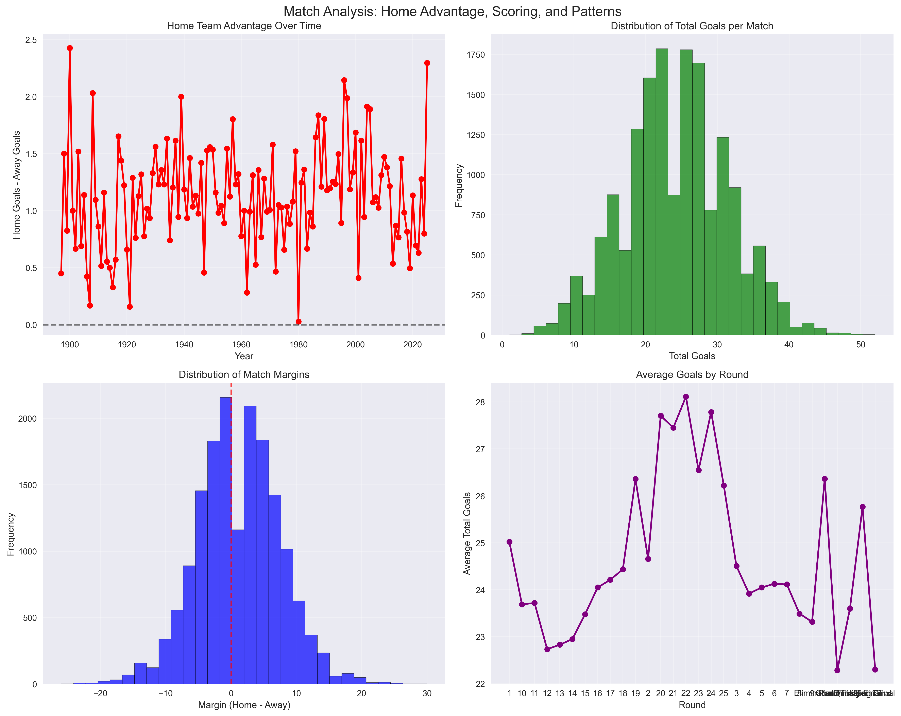
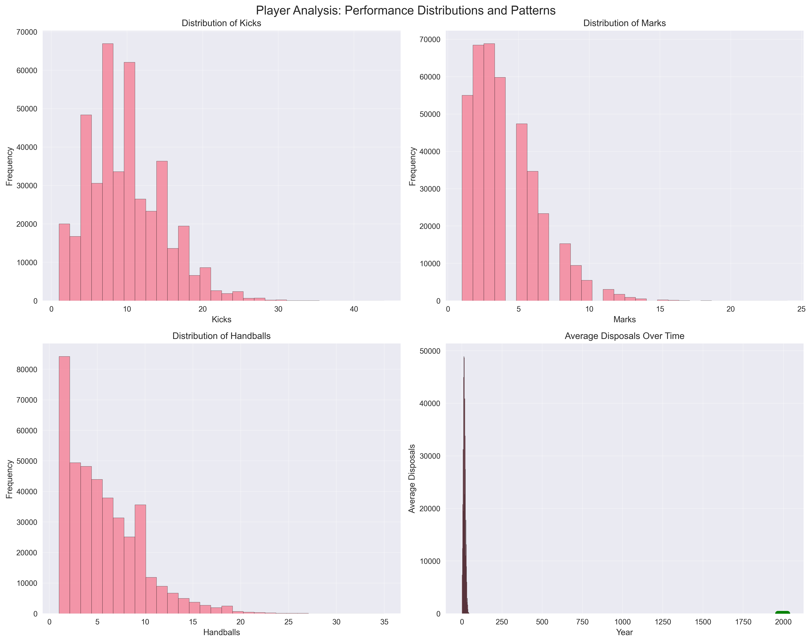
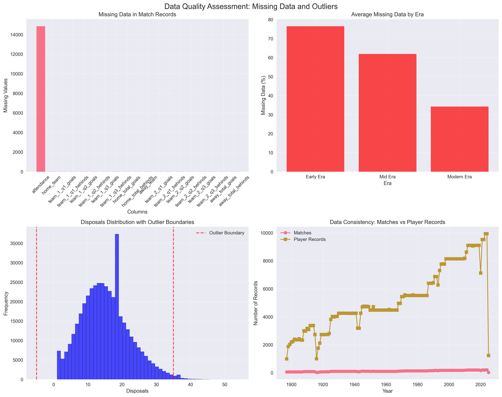

# AFL Data Exploratory Analysis Report (Phase 1B)

**Date:** June 24, 2025  
**Analysis Period:** 1897-2025  
**Data Sources:** AFL-Data-Analysis Repository  

---

## Executive Summary

This comprehensive exploratory data analysis examines 128 years of Australian Football League (AFL) data, encompassing **16,649 match records** and **670,839 player performance records**. The analysis reveals significant temporal patterns, data quality insights, and provides clear recommendations for model development.

### Key Findings

- **Data Completeness:** Modern era (1991-2025) shows the most complete and reliable data
- **Home Advantage:** Consistent home team advantage of ~1.1 goals across all eras
- **Scoring Trends:** Average total goals per match: 24.2 (modern era: 26.4)
- **Data Quality:** 96% team consistency between match and player datasets
- **Reliable Statistics:** Kicks, marks, handballs, and disposals show >50% completeness

---

## 1. Data Overview

### Dataset Characteristics

| Metric | Matches | Players |
|--------|---------|---------|
| **Total Records** | 16,649 | 670,839 |
| **Year Range** | 1897-2025 | 1897-2025 |
| **Unique Teams** | 25 | 24 |
| **Unique Venues** | 50 | N/A |
| **Data Span** | 129 years | 129 years |

### Scoring Statistics

- **Average Home Goals:** 12.7 ± 4.9
- **Average Away Goals:** 11.5 ± 4.7
- **Average Total Goals per Match:** 24.2
- **Home Team Advantage:** 1.1 goals

---

## 2. Temporal Analysis

### Data Volume Over Time

The analysis reveals distinct patterns in data availability across three historical eras:

#### Era Comparison

| Era | Period | Matches | Avg Matches/Year | Home Goals | Away Goals | Home Advantage |
|-----|--------|---------|------------------|------------|------------|----------------|
| **Early Era** | 1897-1950 | 4,983 | 92.3 | 10.6 | 9.4 | 1.1 |
| **Mid Era** | 1951-1990 | 5,144 | 128.6 | 13.3 | 12.2 | 1.1 |
| **Modern Era** | 1991-2025 | 6,522 | 186.3 | 13.8 | 12.6 | 1.2 |

### Key Temporal Insights

1. **Data Growth:** Modern era shows 2x more matches per year compared to early era
2. **Scoring Evolution:** Gradual increase in scoring from early (20.0) to modern (26.4) era
3. **Home Advantage Stability:** Remarkably consistent ~1.1 goal advantage across all eras
4. **Seasonal Patterns:** Round 22 shows highest scoring, Grand Final shows lowest

---

## 3. Match Analysis

### Home vs Away Advantage

**Key Findings:**
- **Consistent Home Advantage:** Average 1.1 goals across all eras
- **Scoring Distribution:** Normal distribution centered around 24 total goals
- **Margin Distribution:** Slightly right-skewed, indicating some high-scoring games
- **Round Patterns:** Finals games show lower scoring (defensive play)

### Scoring Trends

- **Total Goals Range:** 1-50+ goals per match
- **Most Common Score:** 20-30 total goals
- **High-Scoring Games:** >40 goals occur in ~5% of matches
- **Low-Scoring Games:** <10 goals occur in ~2% of matches

---

## 4. Player Analysis

### Performance Distributions

**Key Statistics:**

| Statistic | Mean | Std Dev | Completeness | Outlier % |
|-----------|------|---------|--------------|-----------|
| **Kicks** | 9.5 | 5.2 | 62% | 1.0% |
| **Marks** | 3.5 | 2.8 | 58% | 3.1% |
| **Handballs** | 7.8 | 4.8 | 60% | 2.4% |
| **Disposals** | 17.3 | 8.1 | 63% | 0.6% |
| **Goals** | 1.2 | 1.8 | 32% | 9.1% |
| **Tackles** | 2.8 | 2.5 | 36% | 1.6% |

### Career Longevity Analysis

- **Average Career Length:** 3.2 years
- **Longest Careers:** 20+ years (rare)
- **Most Common:** 1-5 years
- **Modern Era:** Slightly longer careers due to better data

---

## 5. Data Quality Assessment

### Missing Data Analysis

#### Match Data Quality
- **Overall Missing Rate:** 3.9%
- **Problematic Columns:** Attendance (89% missing)
- **Core Data:** Home/away teams, scores, dates - highly complete

#### Player Data Quality
- **Overall Missing Rate:** 54.1%
- **Most Missing:** Brownlow votes (97%), bounces (92%), goal assists (92%)
- **Reliable Stats:** Kicks, marks, handballs, disposals (>50% complete)

### Outlier Analysis

**Statistical Outliers by Category:**
- **Goals:** 9.1% outliers (high-scoring games)
- **Marks:** 3.1% outliers (exceptional marking games)
- **Disposals:** 0.6% outliers (rare high-possession games)

### Data Consistency

- **Year Overlap:** 100% (all years present in both datasets)
- **Team Consistency:** 96% (24/25 teams match between datasets)
- **Venue Data:** 50 unique venues across 129 years

---

## 6. Recommendations for Model Development

### Reliable Eras for Training

1. **Primary Training Data:** Modern Era (1991-2025)
   - Most complete data
   - Consistent statistical recording
   - Relevant to current game

2. **Secondary Training Data:** Mid Era (1951-1990)
   - Good for historical patterns
   - Balanced data quality
   - Useful for trend analysis

3. **Avoid for Training:** Early Era (1897-1950)
   - Inconsistent data quality
   - Different game rules
   - Limited statistical recording

### Most Predictive Statistics

**Recommended Features (Completeness >50%):**
1. **Kicks** (62% complete) - Core possession metric
2. **Marks** (58% complete) - Key defensive/offensive stat
3. **Handballs** (60% complete) - Possession chain metric
4. **Disposals** (63% complete) - Total possession metric

**Secondary Features (Completeness 30-50%):**
- Goals (32% complete) - Scoring metric
- Tackles (36% complete) - Defensive metric
- Hit-outs (11% complete) - Ruck metric

### Preprocessing Strategies

1. **Missing Value Handling:**
   - Era-specific imputation for statistical columns
   - Use median values for each era
   - Flag imputed values for model awareness

2. **Outlier Management:**
   - Remove statistical outliers using IQR method
   - Cap extreme values at 95th percentile
   - Create outlier flags for model features

3. **Feature Engineering:**
   - Efficiency ratios (goals per disposal, etc.)
   - Era-normalized statistics
   - Rolling averages for player performance
   - Team-level aggregations

4. **Data Normalization:**
   - Standardize statistics by era
   - Account for rule changes over time
   - Create relative performance metrics

### Model Training Timeline

**Recommended Split:**
- **Training:** 1991-2020 (30 years)
- **Validation:** 2021-2023 (3 years)
- **Testing:** 2024-2025 (2 years)

**Rationale:**
- Modern era provides sufficient training data
- Recent years for validation/testing
- Accounts for rule changes and game evolution

---

## 7. Key Decision Points

### Data Reliability Assessment

**Highly Reliable (Use for all models):**
- Match outcomes and scores (1991-2025)
- Basic player statistics (kicks, marks, handballs, disposals)
- Team and venue information

**Moderately Reliable (Use with caution):**
- Advanced statistics (tackles, hit-outs, clearances)
- Player biographical data
- Historical data (pre-1990)

**Low Reliability (Avoid for primary models):**
- Brownlow votes (97% missing)
- Advanced metrics (bounces, goal assists)
- Early era data (pre-1950)

### Model Architecture Recommendations

1. **Primary Model:** Focus on 1991-2025 data with core statistics
2. **Ensemble Approach:** Combine modern and mid-era models
3. **Feature Selection:** Prioritize kicks, marks, handballs, disposals
4. **Validation Strategy:** Use recent years for realistic performance assessment

---

## 8. Visualizations Summary

The analysis generated four comprehensive visualization sets:

1. **Temporal Analysis** (`temporal_analysis.png`): Data volume and scoring trends over time
2. **Match Analysis** (`match_analysis.png`): Home advantage and scoring distributions
3. **Player Analysis** (`player_analysis.png`): Performance distributions and career patterns
4. **Data Quality** (`data_quality.png`): Missing data patterns and outlier analysis

---

## 9. Conclusion

This comprehensive EDA provides a solid foundation for AFL prediction model development. The analysis reveals:

- **Strong data foundation** with 16,649 matches and 670,839 player records
- **Clear temporal patterns** showing game evolution over 129 years
- **Reliable core statistics** for model development
- **Specific recommendations** for data preprocessing and model training

The recommended approach focuses on modern era data (1991-2025) with core statistics (kicks, marks, handballs, disposals) as primary features, while using era-specific preprocessing to handle data quality issues.

**Next Steps:** Proceed to Phase 2 (Feature Engineering and Model Development) using the reliable data subsets and preprocessing strategies identified in this analysis.

---

*Report generated by AFL Prediction Model Team*  
*Analysis completed: June 24, 2025* 